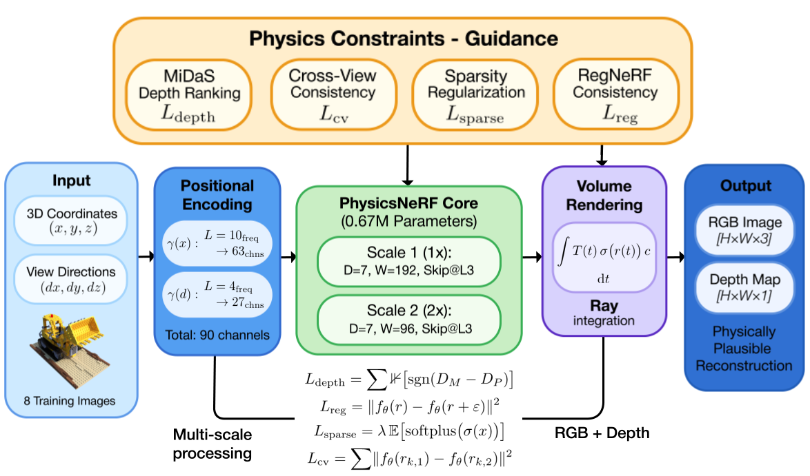

# PhysicsNeRF: Physics-Guided 3D Reconstruction from Sparse Views

> **Disclaimer:**  
> PhysicsNeRF is currently under active development. This repository provides the general structure of the codebase and selected implementation components. The complete, fully optimized codebase will be made available upon the official release of the full research paper. Thank you for your patience and interest in our work.

**[Mohamed Rayan Barhdadi](https://bmrayan.github.io/)¹, [Hasan Kurban](https://www.hasankurban.com/)², [Hussein Alnuweiri](https://www.qatar.tamu.edu/academics/ecen/faculty-and-staff/dr.-hussein-alnuweiri)²**

¹Department of Electrical and Computer Engineering, Texas A&M University, Doha, Qatar  
²College of Science and Engineering, Hamad Bin Khalifa University, Doha, Qatar

*Corresponding author: rayan.barhdadi@tamu.edu*

**Accepted at ICML 2025 Workshop: Building Physically Plausible World Models**  
**arXiv:** [arXiv:2505.23481](https://arxiv.org/abs/2505.23481)

## TL;DR - Abstract

We present PhysicsNeRF, a novel approach for physically consistent 3D reconstruction from sparse views by augmenting Neural Radiance Fields with physical priors. Our method integrates four complementary physics-based constraints: depth ranking supervision, RegNeRF consistency regularization, sparsity constraints, and cross-view consistency through a carefully designed 0.67M parameter architecture.


*Figure 1: PhysicsNeRF architecture and physics-guided constraints overview.*

## Key Features

- **Sparse-view reconstruction** with only 8 training views
- **Physics-guided constraints** for geometric plausibility
- **Progressive training strategy** with curriculum learning
- **Balanced architecture design** (0.67M parameters)
- **Comprehensive evaluation** on static and dynamic scenes

## Results Summary

| Object | Train PSNR | Test PSNR | Gap (dB) |
|--------|-------------|------------|----------|
| Chair  | 23.2        | 18.5       | 4.7      |
| Lego   | 21.7        | 15.0       | 6.7      |
| Drums  | 19.2        | 12.0       | 7.2      |
| **Average** | **21.4** | **15.2**  | **6.2**  |

## Method Overview

### Architecture

- Dual-scale coordinate processing (1× and 2×)
- D=7 layers, W=192 dimensions
- Moderate dropout (0.25) for regularization
- LayerNorm for training stability

### Physics Constraints

1. **Depth Ranking**: Monocular depth consistency using MiDaS
2. **RegNeRF Consistency**: Ray perturbation regularization  
3. **Sparsity**: Realistic density distributions
4. **Cross-View**: Multi-view geometric coherence

### Progressive Training

- Phase 1 (0-5k): α=0.008 (gentle start)
- Phase 2 (5k-15k): α=0.025 (light regularization)
- Phase 3 (15k+): α=0.08 (full constraints)

## Installation

Clone repository
git clone https://github.com/bmrayan/PhysicsNeRF.git
cd PhysicsNeRF

Install dependencies
pip install -r requirements.txt

Download NeRF synthetic data
wget [https://drive.google.com/uc?id=18JxhpWD-4ZmuFKLzKlAw-w5PpzZxXOcG](https://drive.google.com/drive/folders/1cK3UDIJqKAAm7zyrxRYVFJ0BRMgrwhh4)
unzip nerf_synthetic.zip -d data/

## Quick Start

Train on Lego scene (8 views)
python train_physics_nerf.py --config configs/lego_config.json

Train on Chair scene
python train_physics_nerf.py --config configs/chair_config.json

Train on Drum scene
python train_physics_nerf.py --config configs/drum_config.json

Evaluate trained model
python evaluate.py --checkpoint checkpoints/best_model.pt --config configs/lego_config.json


## Training Details

- **Framework**: PyTorch 1.9+
- **Training Views**: 8 sparse views
- **Iterations**: 150k with progressive constraint scheduling
- **Hardware**: NVIDIA GPU with 8GB+ VRAM
- **Training Time**: ~6-8 hours

## Physics Constraint Scheduling

- **Phase 1 (0-5k)**: α=0.008 (gentle initialization)
- **Phase 2 (5k-15k)**: α=0.025 (light regularization)
- **Phase 3 (15k+)**: α=0.08 (full physics constraints)

## Key Findings

1. **Overfitting Challenge**: Generalization gaps of 4.7-7.2 dB demonstrate fundamental sparse-view limitations
2. **Training Dynamics**: Collapse-recovery patterns reveal optimization landscape complexities
3. **Physics Effectiveness**: Progressive constraints improve convergence but cannot eliminate overfitting
4. **Architecture Balance**: 0.67M parameters provide optimal capacity-generalization trade-off

## Citation

If you find this work useful in your research, please consider citing:

```
@inproceedings{barhdadi2025physicsnerf,
  title     = {PhysicsNeRF: Physics-Guided 3D Reconstruction from Sparse Views},
  author    = {Barhdadi, Mohamed Rayan and Kurban, Hasan and Alnuweiri, Hussein},
  booktitle = {International Conference on Machine Learning (ICML), Building Physically Plausible World Models},
  year      = {2025},
  note      = {arXiv preprint \href{https://arxiv.org/abs/2505.23481}{arXiv:2505.23481}},
  url       = {https://arxiv.org/abs/2505.23481}
}
```

## Acknowledgments

This work builds upon NeRF, RegNeRF, and MiDaS. We thank the reviewers for their valuable feedback and the research community for their continued support during the development of this work.

## Contact

For questions, suggestions, or collaboration opportunities, please feel free to reach out:
- **Primary Contact**: Mohamed Rayan Barhdadi (rayan.barhdadi@tamu.edu)
- **Project Repository**: https://github.com/bmrayan/PhysicsNeRF

**Note**: This implementation represents ongoing research efforts. Updates and improvements will be released as development progresses. We encourage the community to follow the repository for the latest developments and full code release.

